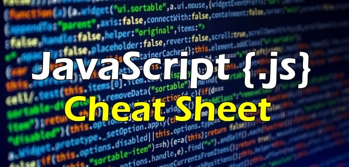

  

&nbsp;

# JavaScript-Cheat-Sheet--Binge-Worthy

## Table of contents

- [Overview](#overview)
- [Resources](#resources)
  - [PDF](#PDF)
- [Author](#author)

## Overview

JavaScript cheat sheet for developers with basic knowledge.

## Resources

- [Variables - Storing the information you need](https://developer.mozilla.org/en-US/docs/Learn/JavaScript/First_steps/Variables)- MDN Web Docs
- [Data Types and Data Structures](https://developer.mozilla.org/en-US/docs/Web/JavaScript/Data_structures)- MDN Web Docs
- [Expressions and Operators](https://developer.mozilla.org/en-US/docs/Web/JavaScript/Guide/Expressions_and_Operators) - MDN Web Docs
- [How is == (loose equality) different from === (strict equality)](https://www.freecodecamp.org/news/loose-vs-strict-equality-in-javascript/) - freeCodeCamp
- [If, Else, Else If](https://www.w3schools.com/js/js_if_else.asp) - w3schools
- [Array](https://developer.mozilla.org/en-US/docs/Web/JavaScript/Reference/Global_Objects/Array) - MDN Web Docs
- [For statement creates a loop](https://ukvirtfept102-osc3606.slack.com/archives/C05SALHNLRF/p1699473768005919) - MDN Web Docs
- [Switch Statement](https://developer.mozilla.org/en-US/docs/Web/JavaScript/Reference/Statements/switch) - MDN Web Docs
- [ParseInIt() How to take a string and return an integer](https://developer.mozilla.org/en-US/docs/Web/JavaScript/Reference/Global_Objects/parseInt) - MDN Web Docs
- [CharAt() Method - return a character at specified position](https://www.w3schools.com/jsref/jsref_charat.asp) - w3schools
- [Math Random](https://developer.mozilla.org/en-US/docs/Web/JavaScript/Reference/Global_Objects/Math/random) - MDN Web Docs
-	[Math Floor](https://developer.mozilla.org/en-US/docs/Web/JavaScript/Reference/Global_Objects/Math/floor) - MDN Web Docs
- [JavaScript Objects](https://www.w3schools.com/js/js_objects.asp) - w3schools
- [Object](https://developer.mozilla.org/en-US/docs/Web/JavaScript/Reference/Global_Objects/Object) - MDN Web Docs
- [Working with objects](https://developer.mozilla.org/en-US/docs/Web/JavaScript/Guide/Working_with_objects) - MDN Web Docs
- [Working with JSON](https://developer.mozilla.org/en-US/docs/Learn/JavaScript/Objects/JSON) - MDN Web Docs
- [Functions](https://www.codecademy.com/learn/introduction-to-javascript/modules/learn-javascript-functions/cheatsheet) - Codecademy
  
### PDF

- PDF Link - [Table data](https://github.com/YTasheva/JavaScript-Cheat-Sheet--Binge-Worthy/blob/main/JavaScript%20Cheat%20sheet%20-%20table.pdf)

- iLoveCoding PDF - [Download the full 13-page PDF](https://github.com/YTasheva/JavaScript-Cheat-Sheet--Binge-Worthy/blob/main/iLoveCoding%20Javascript-cheatsheet.pdf)

### Links

- Solution URL: (https://github.com/YTasheva/JavaScript-Cheat-Sheet--Binge-Worthy.git)
- Live Site URL:

## Author

- Github - [Yuliya Tasheva](https://github.com/YTasheva)
